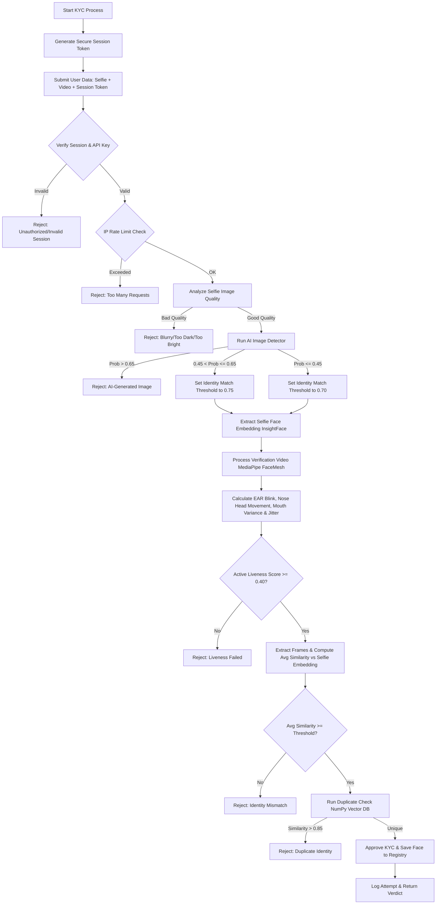

# 🔐 Bruh_KYC — AI-Powered Identity Verification System

> A full-stack **Know Your Customer (KYC)** identity verification platform. It integrates **Active Liveness Detection**, **Deepfake & AI-Image Detection**, **Facial Recognition & Embedding Matching**, and **Anti-Duplicate Enrollment** to deliver secure, real-time identity vetting.

---

## 📋 Table of Contents

- [Overview](#-overview)
- [Architecture & Verification Workflow](#-architecture--verification-workflow)
- [Key Features](#-key-features)
- [Tech Stack](#-tech-stack)
- [Project Directory Structure](#-project-directory-structure)
- [Mathematical & Algorithmic Details](#-mathematical--algorithmic-details)
- [Installation & Local Setup](#-installation--local-setup)
- [API Reference](#-api-reference)
- [Testing & Validation](#-testing--validation)
- [Production & Security Hardening Checklist](#-production--security-hardening-checklist)
- [Acknowledgments](#-acknowledgments)

---

## 🎯 Overview

**Bruh_KYC** is designed to mitigate identity fraud and enrollment spoofing. It processes a user-submitted selfie image and a short verification video to ensure that:
1. The submission is not an AI-generated deepfake.
2. The user is actively present (liveness checked via blinks, head/mouth movements).
3. The selfie and video stream represent the same person.
4. The user is not already registered under a different name (anti-duplicate enrollment matching).

---

## ⚙️ Architecture & Verification Workflow

The verification pipeline executes multiple security, image quality, and computer vision filters before reaching a final decision.

### System Flowchart (Mermaid)



---

## ✨ Key Features

| Feature | Implementation | Description |
| :--- | :--- | :--- |
| 🤖 **AI Image Detection** | Hugging Face Transformers (`umm-maybe/ai-image-detector`) | Flags synthetic/AI-generated selfies. Dynamically tightens subsequent similarity thresholds if the image is borderline synthetic. |
| 👁️ **Active Liveness Verification** | MediaPipe FaceMesh | Performs Eye Aspect Ratio (EAR) blink tracking, nose-based head movement, mouth variance, and movement jitter check. |
| 🔍 **Facial Recognition & Comparison** | InsightFace (`buffalo_l` model) | Extracts a robust 512-D spatial face embedding vector for matching the video frames and selfie. |
| 🛡️ **Anti-Duplicate Enrollment** | Cosine Similarity Check | Scans a local NumPy-based vector registry to prevent users from enrolling multiple times under different identities. |
| 🔐 **API Guardian & Security** | Tokens, TTL & Sliding Rate Limits | Uses sliding window rate limiting (5 req/10s per IP) and short-lived session tokens (5-minute TTL) to safeguard endpoints. |
| 📊 **Admin Dashboard & Audit logs** | Session-level Audit trail | Captures and logs all KYC outcomes, matching scores, and classification thresholds into `attempt_log.json`. |

---

## 🛠️ Tech Stack

### Backend Core
* **Python 3.11+**
* **FastAPI**: Async, high-performance web API framework.
* **InsightFace**: Deep learning face analysis toolbox using the 512-D `buffalo_l` model.
* **MediaPipe**: Real-time landmark prediction (FaceMesh solver).
* **PyTorch & Hugging Face Transformers**: Visual classification runner.
* **OpenCV & NumPy**: Multi-dimensional matrix operations and image processing.
* **Uvicorn**: ASGI web server.

### Frontend Application
* **React 19**: Modern declarative UI framework.
* **Vite**: Frontend bundle tooling and dev server.
* **Material-UI (MUI) v7**: Pre-styled responsive components.
* **Axios**: Promised-based client for request serialization and API key interpolation.
* **React Router v7**: Declarative client-side routing interface.

---

## 📁 Project Directory Structure

```text
Bruh_KYC/
├── backend/
│   ├── app/
│   │   ├── __init__.py
│   │   ├── main.py                   # FastAPI application initialization & middleware
│   │   ├── api/
│   │   │   ├── __init__.py
│   │   │   └── kyc.py                # Main KYC endpoints (session, verify, search, registry)
│   │   ├── services/
│   │   │   ├── __init__.py
│   │   │   ├── active_liveness.py    # MediaPipe FaceMesh blink, head, and mouth analysis
│   │   │   ├── ai_image_detector.py  # Hugging Face AI image classification (umm-maybe)
│   │   │   ├── embedding.py          # InsightFace 512-D facial feature extraction
│   │   │   ├── face_detection.py     # Singular face containment validation
│   │   │   ├── face_model.py         # InsightFace Model downloader and initiator
│   │   │   ├── image_quality.py      # OpenCV Laplacian blur and brightness calculator
│   │   │   ├── liveness.py           # Passive motion-based validation backup
│   │   │   ├── similarity.py         # Cosine similarity and threshold matching
│   │   │   ├── video_processing.py   # Frames extractor wrapper
│   │   │   └── vision_pipeline.py    # Orchestration layout for unified vision services
│   │   ├── db/
│   │   │   ├── __init__.py
│   │   │   └── vector_store.py       # NumPy storage manager (.npy database & stored images)
│   │   ├── decision/
│   │   │   ├── __init__.py
│   │   │   └── decision_engine.py    # KYC approval/rejection heuristics
│   │   ├── security/
│   │   │   ├── __init__.py
│   │   │   ├── auth.py               # Headers-based x-api-key authenticator
│   │   │   ├── rate_limit.py         # IP-based sliding window rate limiter
│   │   │   └── session_guard.py      # Cryptographic session manager with TTL
│   │   ├── admin/
│   │   │   ├── __init__.py
│   │   │   ├── admin_routes.py       # Stats, logs & attempts retrieval
│   │   │   └── attempt_logger.py     # JSON audit trail writer
│   │   ├── utils/
│   │   │   ├── __init__.py
│   │   │   └── logger.py             # Console event logger
│   │   └── test_services.py          # Pipeline sandbox test client
│   ├── requirements.txt              # Backend requirements list
│   ├── attempt_log.json              # Persistent audit log
│   ├── stored_embeddings.npy         # Numpy database for facial vectors
│   └── stored_images/                # Directory containing registered face crops
│
├── frontend/
│   ├── src/
│   │   ├── App.jsx                   # Component layout and routing configuration
│   │   ├── main.jsx                  # Main DOM entrypoint
│   │   ├── Pages/
│   │   │   ├── Home/
│   │   │   │   ├── home.jsx          # Dashboard/Home page orchestrator
│   │   │   │   ├── Hero.jsx          # Hero structure layout
│   │   │   │   ├── LeftSection.jsx   # CTA trigger page and session token retriever
│   │   │   │   ├── RightSection.jsx  # Hero layout graphic component
│   │   │   │   ├── navbar.jsx        # Top navigation element
│   │   │   │   └── footer.jsx        # Page footer block
│   │   │   └── KYC/
│   │   │       ├── KYC.jsx           # Unified KYC Stepper controller
│   │   │       ├── GeneralInfo.jsx   # Text inputs and selfie image file upload
│   │   │       ├── VideoVerification.jsx # WebRTC-based camera stream & MediaRecorder UI
│   │   │       └── Result.jsx        # Verification loading and verdict presenter
│   │   └── Services/
│   │       ├── api.jsx               # Central Axios client (base URL + x-api-key interceptor)
│   │       └── Upload.jsx            # Multi-part post form dispatcher
│   ├── index.html
│   ├── package.json                  # Frontend dependencies list
│   └── vite.config.js                # Vite build config
│
└── readme.Md                         # Project documentation
```

---

## 🧮 Mathematical & Algorithmic Details

### 1. Vector Cosine Similarity
To identify duplicate faces and verify identities between the selfie and video frames, the system computes the Cosine Similarity between 512-dimensional InsightFace embeddings:

$$\text{Similarity}(A, B) = \frac{A \cdot B}{\|A\|_2 \|B\|_2}$$

* **Anti-Duplicate Threshold**: $0.85$ (Identities above this score are flagged as duplicate).
* **Base Matching Threshold**: $0.70$ (Matching score below this is rejected as an identity mismatch).

### 2. Eye Aspect Ratio (EAR)
For blink liveness verification, $6$ facial landmarks surrounding each eye are extracted via MediaPipe FaceMesh. The aspect ratio is computed as:

$$\text{EAR} = \frac{\|p_2 - p_6\| + \|p_3 - p_5\|}{2 \|p_1 - p_4\|}$$

* **Threshold**: EAR $< 0.20$ is registered as an eye closure.
* **Constraint**: Must remain closed for at least $2$ consecutive frames to register as a valid blink.

### 3. Active Liveness Confidence Score
The total active liveness confidence score is derived from weighted parameters:

$$\text{Score} = 0.30 \times \min\left(1.0, \frac{\text{blinks}}{2}\right) + 0.30 \times \min\left(1.0, \frac{\text{head\_movement}}{3}\right) + 0.20 \times \min\left(1.0, \text{jitter}\right) + 0.10 \times \min\left(1.0, \frac{\text{mouth\_variance}}{3.0}\right)$$

* **Required Threshold**: $\text{Score} \geq 0.40$ to pass.

### 4. Dynamic Threshold Adjustment
If the AI-image detector flags the selfie with an intermediate probability of synthetic generation:

$$\text{Identity Threshold} = \begin{cases} 
0.75 & \text{if } 0.45 < \text{ai\_prob} \leq 0.65 \\
0.70 & \text{if } \text{ai\_prob} \leq 0.45 
\end{cases}$$

If $\text{ai\_prob} > 0.65$, the application immediately rejects the selfie submission as a high-risk AI-generated image.

---

## 🚀 Installation & Local Setup

### Prerequisites
* **Python 3.11+** installed.
* **Node.js 18+** installed.
* Supported web camera (or simulated device for VM testing).
* *Optional*: NVIDIA CUDA drivers (for accelerated PyTorch/InsightFace matching on GPU).

---

### Step 1: Run the Backend Server

1. Navigate to the backend directory:
   ```bash
   cd backend
   ```
2. Create and activate a Python virtual environment:
   ```bash
   python -m venv venv
   # Windows:
   .\venv\Scripts\activate
   # Linux/macOS:
   source venv/bin/activate
   ```
3. Install the dependencies:
   ```bash
   pip install -r requirements.txt
   ```
4. Note: On your initial startup, the InsightFace library will automatically download the `buffalo_l` models to your home directory (`~/.insightface/models/`).
5. Run the FastAPI development server:
   ```bash
   uvicorn app.main:app --reload --host 0.0.0.0 --port 8000
   ```
6. The interactive API documentation will be available at [http://localhost:8000/docs](http://localhost:8000/docs).

---

### Step 2: Run the Frontend App

1. Navigate to the frontend directory:
   ```bash
   cd ../frontend
   ```
2. Install npm dependencies:
   ```bash
   npm install
   ```
3. Boot up the Vite developer environment:
   ```bash
   npm run dev
   ```
4. Access the web interface at [http://localhost:5173](http://localhost:5173).

---

## 📡 API Reference

Endpoints are fortified with key authorization. By default, requests must pass an `x-api-key: hackathon-demo-key` header.

### 1. Generate Session Token
* **Endpoint**: `GET /kyc/session`
* **Headers**: `x-api-key: <key>`
* **Description**: Returns a 32-character hexadecimal token. Session token expires after 5 minutes (300 seconds).
* **Response**:
  ```json
  { "session_token": "a1c2b3e4f5..." }
  ```

### 2. Verify KYC (Unified Pipeline)
* **Endpoint**: `POST /kyc/verify`
* **Headers**: `x-api-key: <key>`
* **Content-Type**: `multipart/form-data`
* **Payload**:
  * `session_token` (Form String): The cryptographic session token.
  * `image` (UploadFile Binary): Selfie Image (PNG/JPEG).
  * `video` (UploadFile Binary): Short verification video clip (MP4).
* **Response (Approved)**:
  ```json
  {
    "status": "approved",
    "active_liveness": {
      "is_live": true,
      "confidence": 0.85,
      "blink_count": 2,
      "head_movement": 3.12,
      "motion_jitter": 0.45,
      "mouth_variance": 4.12,
      "frames_processed": 120
    },
    "ai_probability": 0.012,
    "similarity": 0.892
  }
  ```
* **Response (Rejected - e.g. Duplicate/Synthetic)**:
  ```json
  {
    "status": "rejected",
    "reason": "duplicate identity",
    "active_liveness": { ... },
    "ai_probability": 0.05,
    "similarity": 0.941
  }
  ```

### 3. Admin Queries
Retrieve overall logging statistics and verification records:

* **List Verification Logs**:
  ```bash
  curl -H "x-api-key: hackathon-demo-key" http://localhost:8000/admin/attempts
  ```
* **Fetch Analytics Metrics**:
  ```bash
  curl -H "x-api-key: hackathon-demo-key" http://localhost:8000/admin/stats
  ```
* **Clear Identity Database**:
  ```bash
  curl -X DELETE -H "x-api-key: hackathon-demo-key" http://localhost:8000/kyc/reset
  ```

---

## 🧪 Testing & Validation

To test your vision service parameters locally without deploying the frontend, configure two test pictures and run the CLI script:

1. Place two verification test pictures (e.g. `test1.jpeg`, `test2.jpeg`) in the backend root directory.
2. Open `backend/app/test_services.py` and modify the path parameters at the bottom of the script:
   ```python
   if __name__ == "__main__":
       test_pipeline("test1.jpeg", "test2.jpeg")
   ```
3. Run the script:
   ```bash
   python -m app.test_services
   ```
4. The output will print detail parameters for image blur, brightness levels, face counts, simple movement scores, and duplicate registers.

---

## 🛡️ Production & Security Hardening Checklist

Before launching this project to a live production environment, make sure to implement the following changes:

- [ ] **Environment Secret Keys**: Replace the hardcoded `"hackathon-demo-key"` inside [auth.py](file:///c:/Users/dyara/Bruh_KYC/backend/app/security/auth.py) and frontend clients with a configuration parser loading securely from environment variables (`.env`).
- [ ] **Persistent Database Engine**: Migrate from the flat file NumPy registry (`stored_embeddings.npy`) to a secure database stack like **PostgreSQL** configured with the **pgvector** extension for production-grade embedding matching.
- [ ] **Secure Storage (S3)**: Move saved face crop crops from the local directory ([stored_images](file:///c:/Users/dyara/Bruh_KYC/backend/stored_images/)) into an encrypted cloud bucket (AWS S3, Google Cloud Storage) with fine-grained access policies.
- [ ] **HTTPS/TLS Encryption**: Ensure all API transport channels are encrypted using TLS/HTTPS to secure camera streams during upload transit.
- [ ] **Temporal Liveness Analysis**: Deploy a temporal deep learning model to flag artificial display replays and high-quality printed paper photo spoofs.

---

## 🙏 Acknowledgments

* **InsightFace** for the `buffalo_l` landmark detection and extraction pipeline.
* **MediaPipe** for FaceMesh tracking algorithms.
* **Hugging Face** for hosting the synthetic AI classification weights.
* **FastAPI** & **React** teams for the robust frameworks.

---
*Built for secure, real-time digital identity validation.*
